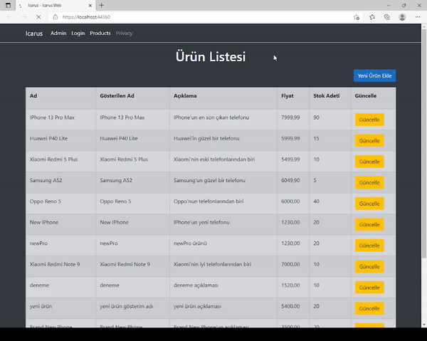

# Gelecek Varlik FullStack Bootcamp Besinci Odevi

### Bu odevde n-tier mimarisi kullanilmis olup, icerisinde CRUD islemlerinin yapilmistir. Web katmaninda projenin arayuzleri bulunmaktadir.

-------------------------------------------------------

    

- API, Model, DB, Service ve Web katmanlari kullanildi.
- Extension Model katmaninda olusturuldu.
- API projesinin Infrastructure class'i icerisinde filterlar ve redis cache ile alakali kodlar yazildi
- Background job'lar uygulandi ve bunlar API projesinde yazildi
- Service katmani icerisinde Validation islemlerini uygulayan ValidationRules adli bir class olusturuldu
- Web katmani icerisinde yetki kontrolu gerceklestirildi ve bu yetki kontrolune gore kullanici islemlerine erisim saglaniyor
- Normal kullanici sadece urunleri listeleyebiliyor ve guncelleyebiliyor. Normal kullanici bunun disindaki islemleri yapamiyor.

## License
[MIT](https://www.mit.edu/)
